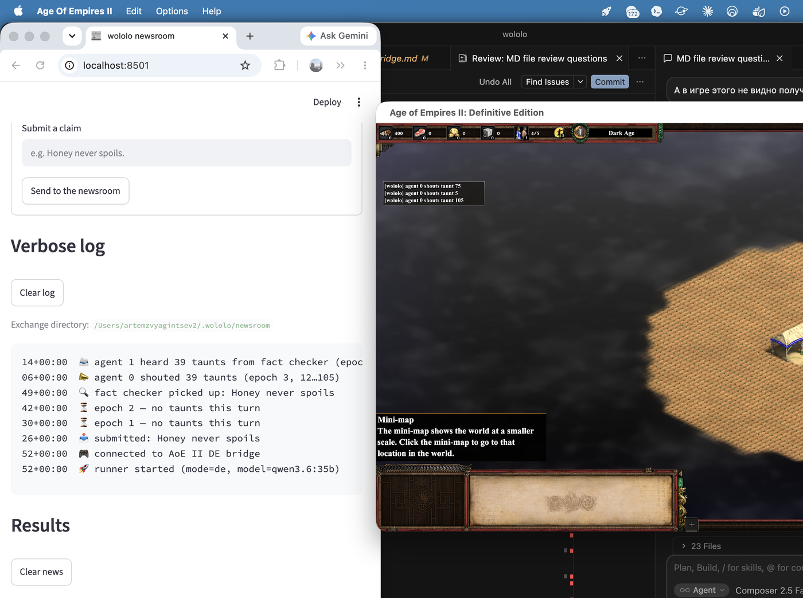
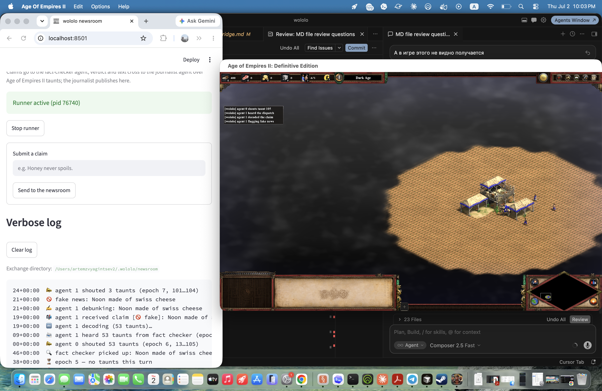
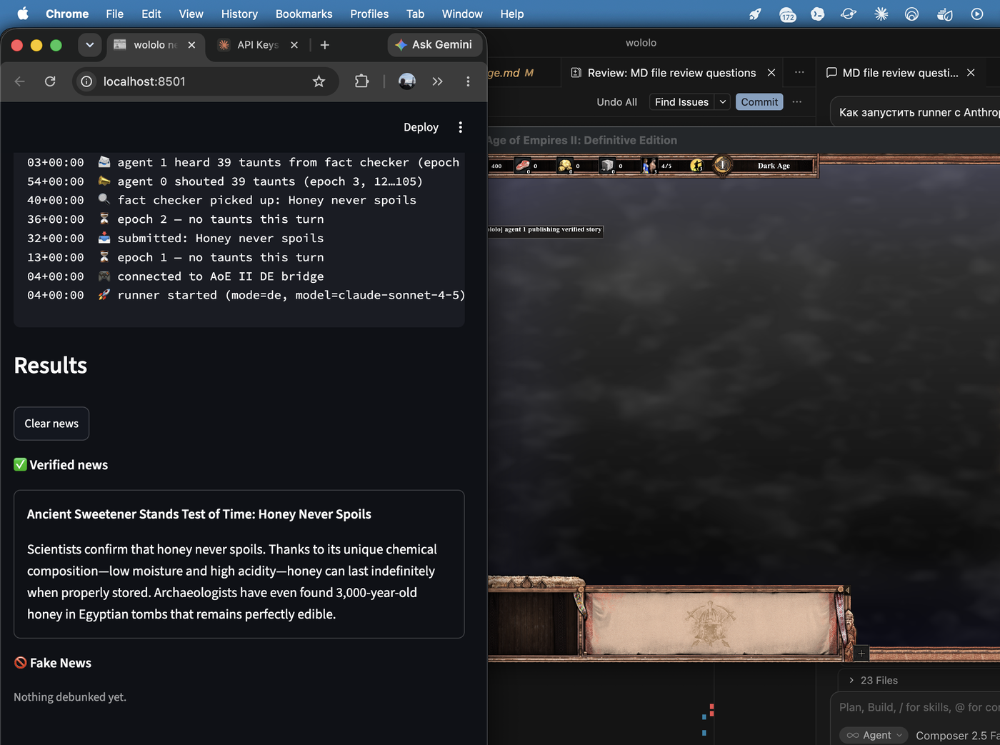
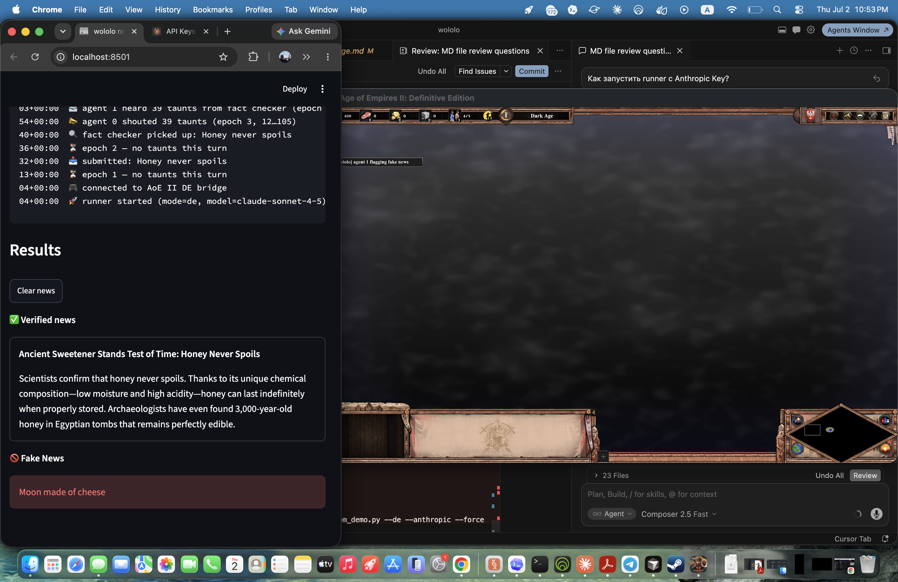

# wololo

Agent orchestration framework whose coordination substrate is Age of Empires II
mechanics. Agents communicate **exclusively** through in-game channels: taunts,
the market, relics, monk conversions, and fog of war. See `CLAUDE.md` for the
full design document.

## Setup

```bash
python -m venv .venv
source .venv/bin/activate
pip install -e ".[dev]"
```

## Development

```bash
pytest -q                      # test suite (must be green before commit)
ruff check . && ruff format .  # lint & format
```

## Running scenarios

```bash
wololo coop_gather            # scripted FakeLlm agents, deterministic
wololo coop_gather --stats    # + taunt n-gram stats (protocol emergence)
wololo coop_gather --runs 10 --stats --record runs.jsonl   # batch harness

pip install -e ".[dev,llm]"   # LLM scenarios need the anthropic extra
ANTHROPIC_API_KEY=... wololo llm_gather --stats        # raw JSON replies
ANTHROPIC_API_KEY=... wololo llm_gather_tools --stats  # tool-use harness

wololo shipping_pipeline      # email -> taunts -> spreadsheet demo (offline)
wololo newsroom_pipeline      # claims -> fact check -> taunts -> dashboard (offline)
```

## Newsroom demo (Streamlit + two agents)

A fact-checking pipeline on top of the tool harness: a Streamlit form drops
reader claims into an inbox file; the *fact checker* agent picks them up
through its private desk tool, decides true/false, and shouts the claim
text across the map as a codec message whose kind encodes the verdict; the
*journalist* agent decodes it and either publishes a story or pins the
claim to the Fake News column of the dashboard. The claim text and the
verdict flag cross between the agents **only** as taunts.

```bash
pip install -e ".[dev,ui,llm]"              # streamlit + Anthropic client
pip install -e ".[dev,ui]"                  # streamlit only (scripted / Ollama)

streamlit run apps/newsroom_app.py          # the form + dashboard
python scripts/newsroom_demo.py             # the agents, scripted models
python scripts/newsroom_demo.py --llm       # the agents, Ollama models
python scripts/newsroom_demo.py --anthropic # the agents, Anthropic API
```

Run the app and the agents side by side; both default to the exchange
directory `~/.wololo/newsroom` (override with `--dir` on both). Offline it
is deterministic (`wololo newsroom_pipeline`, same models as the tests).
With `--llm` or `--anthropic`, the fact-check verdict and the published
story come from the model — expect a minute or two per claim on local
hardware (Ollama) or a few seconds per tool round (Anthropic).

**Ollama** (`--llm`): set `OLLAMA_HOST` (scheme optional, e.g.
`export OLLAMA_HOST=my-box:11434`) or pass `--ollama-url`; default model
`qwen3.6:35b` (override with `--model`).

**Anthropic** (`--anthropic`): set `ANTHROPIC_API_KEY`; default model
`claude-sonnet-4-5` (override with `--model`). Use `--llm` or
`--anthropic`, not both.

```bash
export ANTHROPIC_API_KEY=sk-ant-...
python scripts/newsroom_demo.py --anthropic --force
python scripts/newsroom_demo.py --de --anthropic --force   # over a live match
```

The taunt bus itself is swappable. With `--de` the agents talk over a
**live Age of Empires II DE match** instead of the sim kernel: put the
Streamlit window next to the game window, submit a claim, and watch its
bytes scroll through the match chat as taunt shouts before the story
appears on the dashboard (game setup: `docs/de_bridge.md`).

```bash
python scripts/newsroom_demo.py --de            # scripted, over a live match
python scripts/newsroom_demo.py --de --llm      # Ollama over a live match
python scripts/newsroom_demo.py --de --anthropic  # Anthropic over a live match
python scripts/newsroom_demo.py --de-offline    # same path, FakeDeGame
```

#### Live game quick start (newsroom + `--de`)

One-time game setup (paths, smoke tests): `docs/de_bridge.md`. Then each
session:

1. **Install the bridge script** — copy `xs/wololo.xs` into the game's
   `_common/xs/` folder (Feral macOS:
   `~/Library/Application Support/Feral Interactive/Age Of Empires II/VFS/User/Games/Age of Empires 2 DE/<steam-id>/resources/_common/xs/`).
2. **Start the scenario in the game** — scenario editor → `Script Filename`
   = `wololo` → *Test Scenario*. Wait for
   `[wololo] bridge script initialised` in match chat (no taunt flood on
   a clean start). Keep the match **unpaused**; single-player DE pauses
   when the window loses focus.
3. **Streamlit** (terminal 1): `streamlit run apps/newsroom_app.py`
4. **Runner** (terminal 2), after the game is ticking:

   ```bash
   python scripts/newsroom_demo.py --de --force              # scripted
   python scripts/newsroom_demo.py --de --llm --force        # Ollama
   python scripts/newsroom_demo.py --de --anthropic --force  # Anthropic
   ```

   The runner waits for the game's state file, then loops. Submit a claim
   in the browser; agent 0 shouts the encoded bytes in match chat, agent
   1 answers with short status taunts (`heard the dispatch`, `decoded the
   claim`, …), the story lands on the dashboard.
5. **Stop** — *Stop runner* in Streamlit (or Ctrl-C in terminal 2) before
   restarting the scenario, so stale `wololo_cmd.xsdat` does not replay old
   taunts on the next *Test Scenario*.

For the simpler two-agent negotiation demo (no Streamlit), use
`scripts/de_demo.py` the same way: game scenario running first, then
`python scripts/de_demo.py` (add `--llm` or wire Anthropic via the same
pattern as the newsroom runner).

### Screenshots

Live mode with `--de`: Streamlit on the left, AoE II DE on the right. Agent 0
shouts the encoded claim as taunts; agent 1 echoes short status taunts back
into the match chat (`heard the dispatch`, `decoded the claim`, `publishing…`
/ `flagging fake news`).

**Ollama** (`--de --llm`, model `qwen3.6:35b`):

*Claim in, taunts on the wire*



*Fake-news debunk + in-game acks*



**Anthropic** (`--de --anthropic`, model `claude-sonnet-4-5`):

*Verified story published*



*Verified + fake on the dashboard*



More captures live under `images/ollama/` and `images/anthropic/` (all tracked
in git).

## Running over a real Age of Empires II DE match

The DE bridge drives two agents through an actual game: agent commands go
into `wololo_cmd.xsdat`, the in-game script `xs/wololo.xs` applies them
(taunts echoed into the match chat, market economics, stockpiles mirrored
onto the players' HUD resource counters) and writes the state back. Setup
(copy the XS script, create the scenario, macOS/Feral paths) is in
`docs/de_bridge.md`.

```bash
python scripts/de_demo.py --offline   # rehearse against FakeDeGame, no game
python scripts/de_demo.py             # scripted agents over a live match
python scripts/de_demo.py --llm       # agents backed by local Ollama models
```

`--llm` needs an Ollama server: set `OLLAMA_HOST` (scheme optional, e.g.
`export OLLAMA_HOST=my-box:11434`) or pass `--ollama-url`; defaults to
`http://localhost:11434`. Pick a model with `--model` (default
`qwen3.6:35b`). The client (`agents/ollama.py`) is stdlib-only and works
as a drop-in `LlmClient` alternative to the Anthropic API. Expect minutes
per epoch with local models — the negotiation is real, not scripted.

## Status

- Milestone 1 done: deterministic sim kernel (taunt bus, market, relic
  locks, triggers, fog), taunt codec with varint framing (base-52 chunks
  over the 104 data taunts, taunt 105 as end-of-message marker), FakeLlm
  agents, let-it-crash supervisor, `coop_gather` scenario green in tests.
- Milestone 2 done: `LlmAgent` backed by the Anthropic API (dependency
  confined to `agents/llm.py`, injectable stub clients in tests),
  `llm_gather` cooperative negotiation scenario, taunt n-gram statistics
  for measuring protocol emergence.
- Tool harness done: `ToolLlmAgent` uses Anthropic tool use (action tools
  queue substrate ops; codec helper tools encode/decode structured taunt
  messages locally), plus a batch experiment harness with JSONL run
  records and cross-run n-gram aggregation.
- MCP tool-provider layer done: per-agent `McpToolProvider` sessions give
  agents private real-world tools (email, spreadsheets) with credential
  scoping; the `shipping_pipeline` demo moves an Amazon shipping email
  into a spreadsheet with all agent-to-agent traffic on the taunt codec.
  The `newsroom_pipeline` demo adds a Streamlit front end: reader claims
  are fact-checked by one agent and published (or flagged as Fake News)
  by another, the claim text crossing the map as UTF-8 bytes in taunt
  frames; live mode runs both agents on local Ollama models or the
  Anthropic API (`--llm` / `--anthropic` on `scripts/newsroom_demo.py`).
- Milestone 3 done: AoE II DE bridge — `.xsdat` int32 codec, checksummed
  frame protocol, file mailbox, `DeSubstrate` (taunt + market channels),
  `FakeDeGame` as the executable spec, and `xs/wololo.xs` validated on the
  Feral macOS port. Live demos: `scripts/de_demo.py` (coop negotiation
  over a match) and `scripts/newsroom_demo.py --de` (Streamlit fact-check
  pipeline with claims scrolling through match chat), scripted or
  LLM-backed (Ollama / Anthropic). Runbook: `docs/de_bridge.md`. Relic,
  fog, and monk conversion remain sim-only for now.
