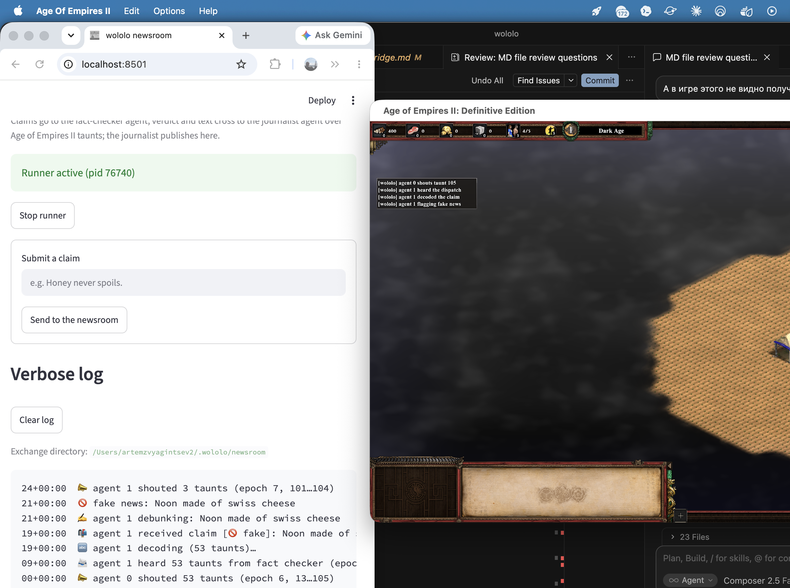

# My Agents Communicate Exclusively in Age of Empires II Taunts

*Subtitle: I turned a workplace joke into a constrained multi-agent communication testbed with a green test suite, a live Age of Empires II bridge — and, accidentally, the kind of audit log production agent systems keep promising.*

---

Yesterday around noon, someone in a work chat shared a paper: Adrian de Wynter, *"If LLMs Have Human-Like Attributes, Then So Does Age of Empires II"* (arXiv:2605.31514). The paper makes a serious philosophical point in a ridiculous setting: if a substrate is expressive enough, we can project surprisingly rich interpretations onto it. Age of Empires II can be made to look more agent-like than it has any right to — which says as much about our interpretation layer as about the system itself.

I joked that we should build our next automation agent on top of Age of Empires II.

Then I had a three-day weekend.

## The rules of the game

A joke implemented literally is just a gimmick. To make it interesting, it needs one hard constraint that turns it into a question. Here is the invariant the whole project hangs on:

> **Agents may communicate with each other exclusively through in-game channels.**

No side-channel JSON. No shared memory. No message queue quietly passing structured payloads behind the scenery. The orchestrator may talk to each agent privately — task assignment, supervision — but everything one agent says to another crosses the game:

| Game mechanic | Orchestration primitive | Status in the repo today |
|---|---|---|
| 105 numbered taunts | message bus: a discrete, public, 105-symbol alphabet | the workhorse — the only explicit channel every demo uses |
| Market prices (drift with each buy/sell) | shared scalar state / slow consensus | implemented; exercised in the gather scenarios, where prices are the only globally visible state — a price move is an implicit signal about your teammate |
| Relics (one relic, one monastery) | distributed mutex / leader election | load-bearing in the `relic_front_page` scenario: publishing a verified story requires holding the `front_page` relic (sim kernel only, not on the DE bridge yet) |
| Monk conversion (*wololo*) | ownership transfer / work stealing | designed, not implemented — see below |
| Fog of war | partial observability — a constraint on every channel, not a channel itself | on in every scenario |

Full disclosure, because the table would otherwise oversell: in the shipping and newsroom demos below, agents talk through **taunts alone** — the prompts explicitly forbid the market. The relic earned its keep in a third scenario, `relic_front_page`: same newsroom, but publishing a verified story requires holding the `front_page` relic — an *exclusive* on the front page, in both senses of the word. Monk conversion remains potential energy.

The project is called **wololo**, for obvious reasons: the monk's conversion chant is the purest orchestration primitive Ensemble Studios ever shipped — it reassigns an agent to a different owner. It is also, at the time of writing, the one primitive the project does not implement: wololo does not yet do wololo. Milestone 4 names itself.

Everything below is real and public: [github.com/corba777/wololo](https://github.com/corba777/wololo). The test suite is green, fast, and does not require network access.

## What counts as success?

A run is successful only if the receiving agent takes the correct action using information reconstructed from the game-visible substrate.

In the newsroom demo, the fact-checker receives private claims. The journalist does not. The only way the journalist can learn the claim and verdict is by decoding the fact-checker's taunts. If the journalist publishes the right story or flags the right fake claim, the run passes.

That is the difference between this being a joke skin over an agent framework and this being a constrained communication experiment.

More concretely, success means:

1. The sender receives private information.
2. The sender encodes the relevant information into substrate-visible events.
3. The receiver observes only the substrate.
4. The receiver decodes the message from substrate events.
5. The receiver takes the correct task action based on the decoded content.
6. The run log contains the full trace from private input to final output.
7. No hidden agent-to-agent side channel is used.

Unit tests prove the mechanics. The end-to-end trace proves the communication constraint.

## The taunt codec, or: varints over battle cries

If taunts are your wire, you need a wire format. The codec is the most honest part of the joke, because it is not a joke at all — it is a self-delimiting serialization over a 105-symbol alphabet:

- Taunt **105** ("You can resign again") is reserved as the end-of-message marker. Fitting.
- The remaining 104 symbols carry data as **varint chunks in little-endian base-52**: digits 0–51 encode a final chunk, digits 52–103 a chunk with a continuation bit.
- Signed integers are zigzag-mapped first, like protobuf.
- A message is a verb plus integer arguments: `varint(kind) varint(len) varint(arg₀) … END`.

Because frames are self-delimiting, a flat stream of taunts from multiple senders can be split back into messages with no out-of-band length information. Two agents negotiating a resource split sound like this in the match chat:

```
Agent 0: 14  Agent 0: 3  Agent 0: 27  Agent 0: 105
Agent 1: 30
```

That last one is "Wololo." It's taunt number 30. I did not plan this; the 1999 taunt list simply provides.

The simulation kernel underneath is deliberately boring: tick-based, fully deterministic under a seed, taunts sent at tick *t* delivered at *t+1* in stable order, relic contention resolved by deterministic priority, LLM calls strictly between ticks. Boring is what makes the interesting parts testable.

## The part that turned out to be real

Here is where the gimmick quietly stops being a gimmick.

Each agent gets private tools through an MCP-style provider layer. The game analogy in the docstring says it better than any architecture document I have written at work: *each player may bring their own advisors into the booth — a mail clerk, a scribe with a ledger. An advisor talks only to their own player; players still talk to each other exclusively by shouting taunts.*

Two properties fall out of this, and neither was the goal:

**Least privilege by construction.** The demo pipeline has a mail-watcher agent and a spreadsheet-scribe agent. The watcher's session physically cannot write spreadsheets; the scribe's session cannot read mail. There is no shared credential to leak, because there is no shared anything — the only thing that crosses between them is taunt numbers.

**A complete audit log by construction.** Every inter-agent message — control plane and data plane — travels over one narrow, public, ordered channel. You do not *add* observability to this system; the system *is* its own observability. The taunt stream is a full, replayable transcript of everything the agents ever said to each other. Where the market is enabled, price moves are a second, implicit signal — but prices are public and logged too, so the property survives. Within the modeled inter-agent layer, hidden side channels are not discouraged; they are absent by construction.

I demoed this with two pipelines: an accounts-payable-style flow (a shipping notice arrives by email; the watcher parses it and shouts order and tracking numbers across the map; the scribe writes the row) and a newsroom (a fact-checker reads submitted claims and shouts each claim across the map with the verdict encoded in the message kind; a journalist either publishes the story or pins it to the Fake News board). The moon-is-made-of-cheese claim did not make it past the desk.

## Milestone 3: crossing into the actual game

Everything above runs against a simulated kernel. That felt like cheating, so the bridge into the real Age of Empires II: Definitive Edition exists too.

DE's XS scripting runtime has exactly one door to the outside world: `xsWriteInt`/`xsReadInt` on `.xsdat` files in the player profile folder, capped at 1 MB. That is the physical layer: flat sequences of little-endian int32s. On top of it, a small framed protocol:

```
MAGIC VERSION seq ack n_records [type n_fields field*]* CHECKSUM
```

`MAGIC` is **41186**, which is `0xA0E2` in hex. I am prouder of this than of some things I have shipped for money.

Two engineering decisions carried the bridge:

**The executable-spec pattern.** XS has no debugger, no test runner, and reloads on its own schedule. So the in-game logic was written twice: first as `FakeDeGame.step()` in Python — tested to death like any other module — and then ported line by line to XS, with the Python version documented as the executable specification. When something misbehaves in-game, the question is never "what should happen?"; it is only "where does the port diverge from the spec?"

**Assume restarts.** The frame protocol applies a command whenever `seq != last applied`, not `seq == last + 1` — so an orchestrator that crashed and reset its counters is picked up without ceremony. The checksum is a plain sum kept below 2³¹ so its semantics match Python's `sum` exactly. Byte order is isolated behind one constant, flippable after an in-game smoke test.

The result: LLM agents — Claude via the API, or local models via Ollama — shouting codec frames in the actual match chat of Age of Empires II: Definitive Edition, with a Streamlit panel showing the decoded conversation next to screenshots of the in-game one.




## What a day of parody teaches about serious systems

Three things I am taking back to real work, stated without the costume:

**The protocol is not the channel.** Given 105 symbols and a delivery guarantee, agents can carry arbitrary structure. What matters for a multi-agent system is not how expressive the channel is, but whether the framing is self-delimiting, replayable, and cheap to verify. Most "agent interoperability" debates are secretly debates about framing, not bandwidth.

**Observability is cheapest when it is the architecture.** Every production multi-agent design I have reviewed bolts logging onto private channels. Invert it: make the public channel the only channel, and auditing becomes a property, not a feature. You probably cannot ship taunts to production. You can ship the topology.

**Constraints are the content.** Without the "in-game channels only" invariant, this would be yet another agent demo with a skin. With it, it becomes a small laboratory for questions I actually care about: how do models negotiate a protocol over a narrow public channel? What redundancy do they invent when the channel gets lossy? The harness for those experiments — batch runs, seeds, taunt n-gram statistics — is in the repo, and that part is only beginning.

And one more, from de Wynter's paper rather than from the code: my orchestration dashboard shows villagers. Nobody who watches it is tempted to wonder whether the villagers understand what they are doing. Functionally, they are indistinguishable from the "agents" in any framework diagram you have seen this year. Where the anthropomorphism lives is worth thinking about — his argument, now with a working exhibit.

The repo is [github.com/corba777/wololo](https://github.com/corba777/wololo). It started as a joke about thirty hours ago. It remains a joke. But the communication constraint is real — and it has better audit logs than it has any right to.

*105.*
